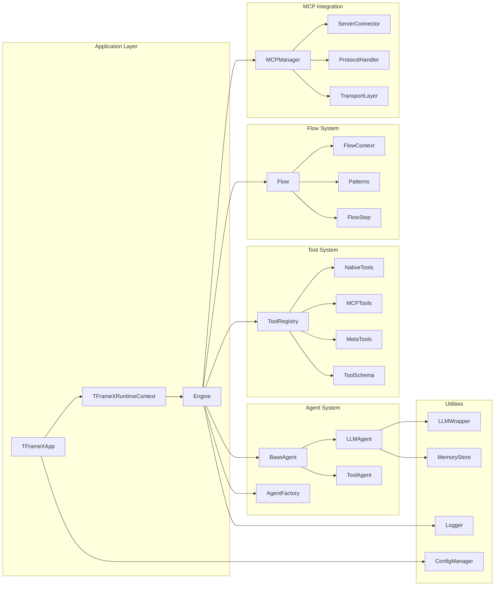
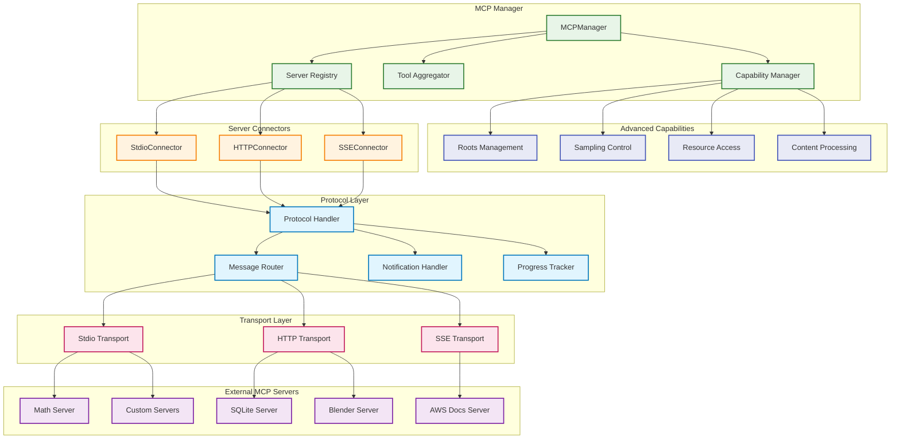
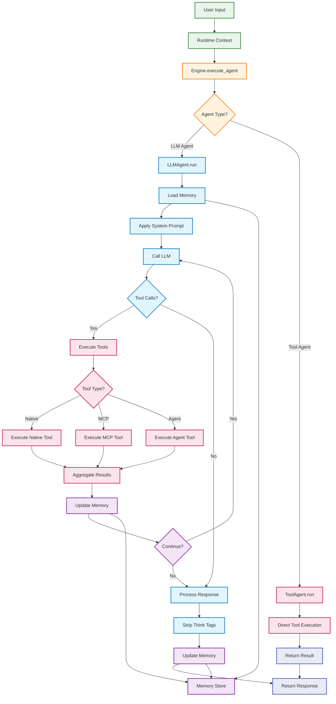
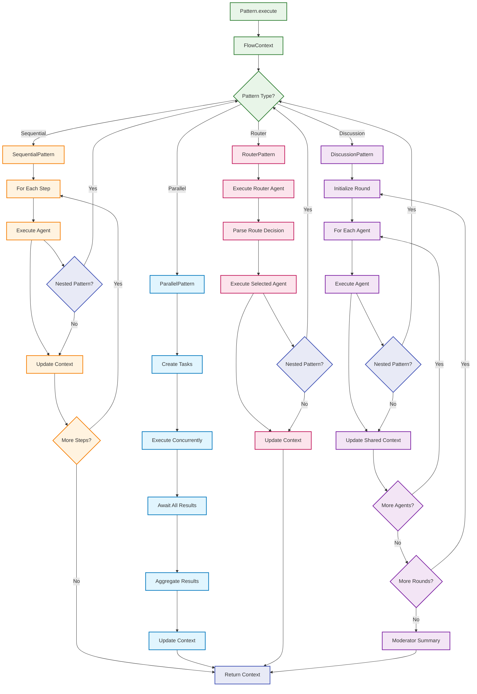
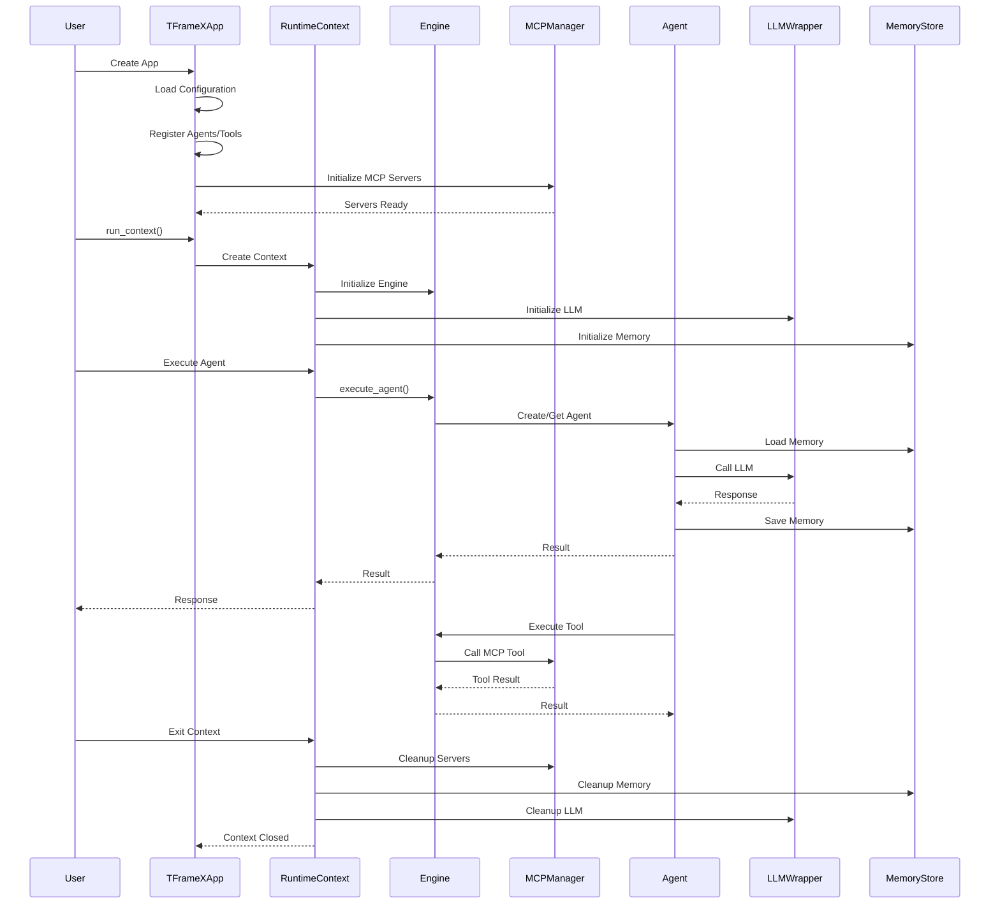
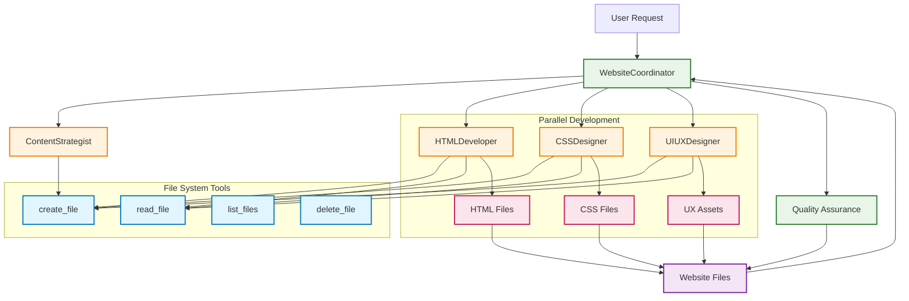
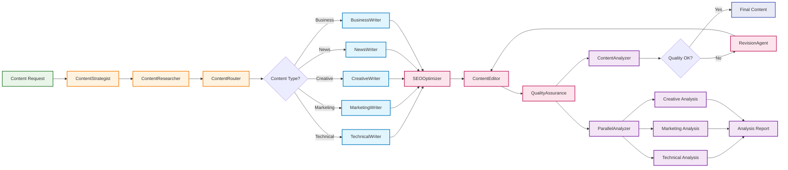
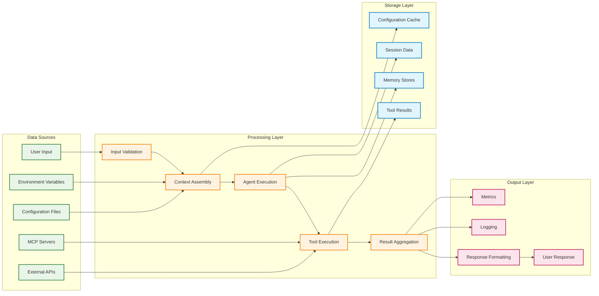
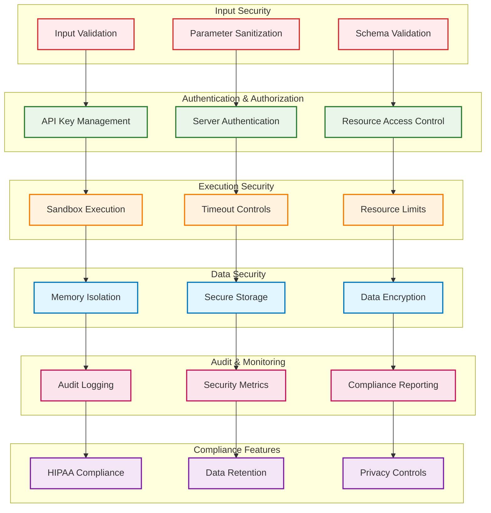

# TFrameX Architecture Diagrams

This document contains comprehensive architectural diagrams for the TFrameX framework, visualizing the core components, relationships, and execution flows.

## 1. Overall Framework Architecture

```mermaid
graph TD
    %% Core Application Layer
    A[TFrameXApp] --> B[TFrameXRuntimeContext]
    A --> C[Agent Registry]
    A --> D[Tool Registry]
    A --> E[Flow Registry]
    A --> F[MCP Manager]
    
    %% Runtime Context Components
    B --> G[Engine]
    B --> H[Memory Stores]
    B --> I[LLM Providers]
    
    %% Agent System
    C --> J[BaseAgent]
    J --> K[LLMAgent]
    J --> L[ToolAgent]
    
    %% Tool System
    D --> M[Native Tools]
    D --> N[MCP Tools]
    D --> O[Agent Tools]
    
    %% Flow System
    E --> P[Flow]
    E --> Q[Patterns]
    Q --> R[SequentialPattern]
    Q --> S[ParallelPattern]
    Q --> T[RouterPattern]
    Q --> U[DiscussionPattern]
    
    %% MCP Integration
    F --> V[MCP Servers]
    F --> W[Protocol Handlers]
    F --> X[Transport Layer]
    
    %% External Systems
    V --> Y[Stdio Servers]
    V --> Z[HTTP Servers]
    X --> AA[SSE Transport]
    X --> AB[HTTP Transport]
    
    %% Style Classes
    classDef core fill:#e1f5fe,stroke:#01579b,stroke-width:2px
    classDef agents fill:#f3e5f5,stroke:#4a148c,stroke-width:2px
    classDef tools fill:#e8f5e8,stroke:#1b5e20,stroke-width:2px
    classDef flows fill:#fff3e0,stroke:#e65100,stroke-width:2px
    classDef mcp fill:#fce4ec,stroke:#880e4f,stroke-width:2px
    
    class A,B,G,H,I core
    class C,J,K,L agents
    class D,M,N,O tools
    class E,P,Q,R,S,T,U flows
    class F,V,W,X,Y,Z,AA,AB mcp
```

## 2. Core Component Architecture

## 3. MCP Integration Architecture

## 4. Agent Execution Flow

## 5. Pattern Execution Flow

## 6. Configuration and Lifecycle

## 7. Example Architecture: Website Designer

## 8. Example Architecture: Content Creation Pipeline

## 9. Data Flow Architecture

## 10. Security and Compliance Architecture

---

These comprehensive architectural diagrams provide a complete visual representation of the TFrameX framework, from high-level architecture to detailed execution flows and example implementations. Each diagram focuses on different aspects of the system, making it easy to understand the framework's design and implementation patterns.